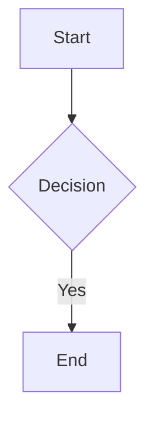
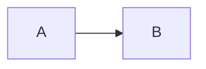
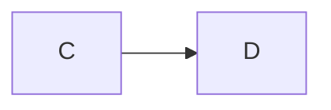
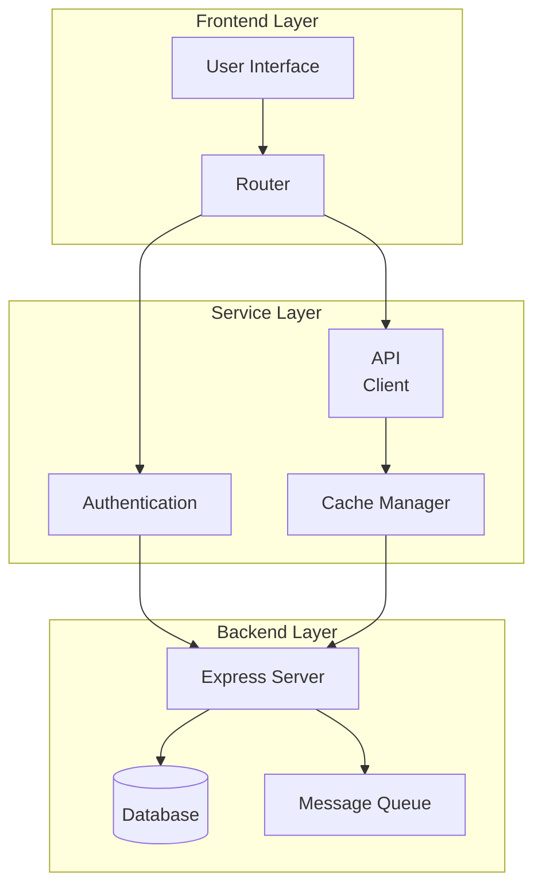
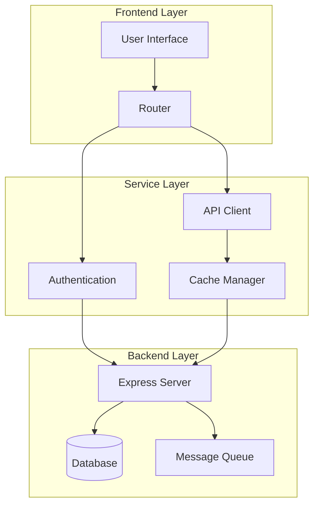
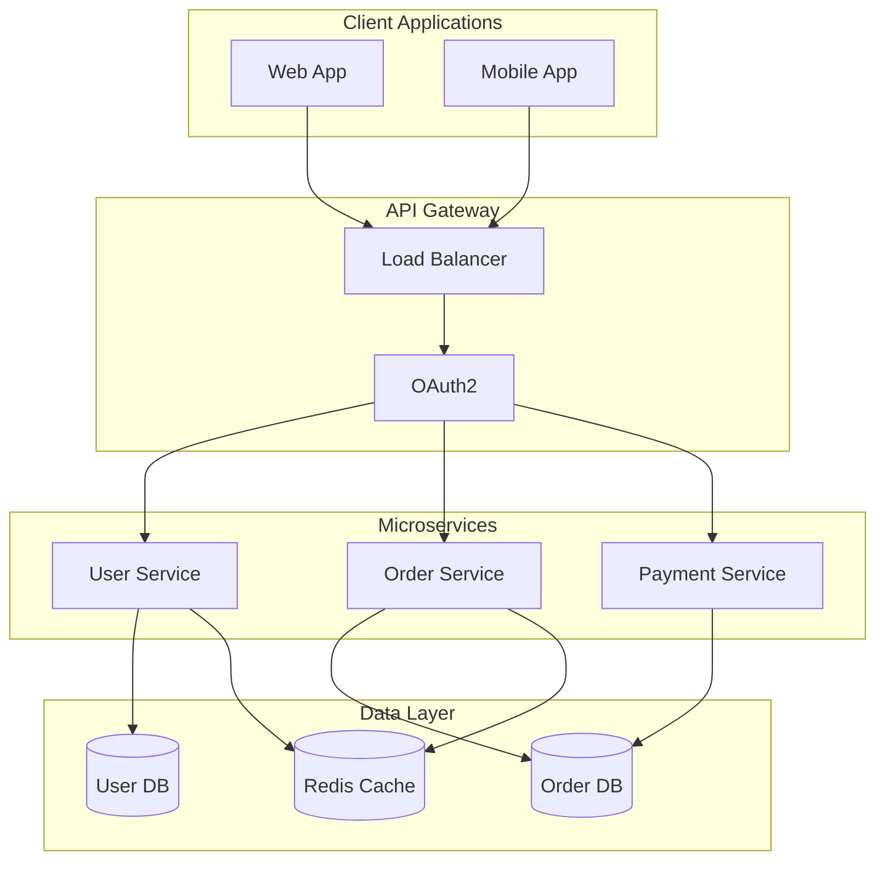

# Mermaid Diagram Syntax Support
The RTF Markdown Editor now supports **both** standard Markdown and Azure DevOps Wiki syntax for Mermaid diagrams.
## Supported Syntax Formats
### Standard Markdown (Triple Backticks)



### Azure DevOps Wiki (Triple Colons)


## Format Preservation
**Important**: The editor preserves the original fence format when you save the document.
- If you use ````mermaid`, it will be saved as ````mermaid`

- If you use `::: mermaid`, it will be saved as `::: mermaid`

This ensures compatibility with:
- GitHub Markdown (uses backticks)

- Azure DevOps Wiki (uses colons)

- GitLab Markdown (uses backticks)

- Standard Markdown parsers

## Implementation Details
### How It Works
- **Parsing**: When opening a document, the parser detects both fence types

- **Storage**: Each mermaid block stores its original fence type (`backtick` or `colon`)

- **Rendering**: Both formats render identically in the WYSIWYG editor

- **Saving**: The original fence type is preserved when converting back to markdown

### Technical Changes
- **Type Definition**: `MermaidBlock` interface now includes `fenceType` property

- **Markdown Processor**: Recognizes both `^```\s*mermaid` and `^:::\s*mermaid` patterns

- **HTML Processor**: Stores fence type in `data-fence-type` attribute on div elements

- **Editor**: Preserves `data-fence-type` attribute through edit cycles

## Testing
Use [test_mermaid_formats.md](test_mermaid_formats.md) to verify:
- Open the test file in the RTF Markdown Editor

- Both backtick and colon formats should render as diagrams

- Make an edit to the document

- Save the document

- Verify in the raw markdown that each format is preserved

## Migration Notes
- **Existing Documents**: All existing mermaid blocks will continue to work

- **Default Format**: New blocks created via the editor use backticks (standard format)

- **Azure DevOps**: Documents with `:::` syntax will preserve that format

- **No Breaking Changes**: The change is fully backward compatible

## Examples
### Mixed Format Document
You can use both formats in the same document:
Standard format:



Azure DevOps format:



Both will render correctly and preserve their original format on save.
## Complex Examples
### Application Architecture (Standard Markdown)



### Application Architecture (Azure DevOps Wiki)



### Microservices Workflow (Standard Markdown)



### Microservices Workflow (Azure DevOps Wiki)

