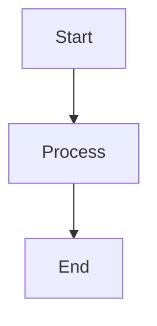

# RTF Markdown Editor

**Word-like WYSIWYG Markdown Editor for VS Code** — RTL-first, Azure DevOps Mermaid, Export & Import Word/HTML/PDF, Autosave, **100% Offline**

A rich text editor extension for VS Code that provides a Microsoft Word / Google Docs-like editing experience for Markdown files, with special emphasis on right-to-left (RTL) languages like Hebrew and Arabic, automatic saving, Mermaid diagram support, and one-click export to HTML, Word (DOCX), or PDF — plus **content extraction from Word and PDF into Markdown** for AI analysis and content migration.

## Features

### ✅ Text Formatting
- **Bold** (Ctrl+B)
- **Italic** (Ctrl+I)
- **Underline** (Ctrl+U)
- **Strikethrough**
- **Inline Code**
- **Superscript & Subscript** (when supported in Markdown)

### ✅ Paragraph & Block Formatting
- **Headings**: H1–H6 style selection
- **Block Quotes**: Multi-level block quotes with > syntax
- **Code Blocks**: Syntax-highlighted with language detection
- **Horizontal Rules**: Visual separator lines
- **Line Breaks**: Soft and hard breaks preserved

### ✅ Lists & Tables
- **Unordered Lists** (bullet points)
- **Ordered Lists** (numbered)
- **Nested Lists**: Full nesting support
- **Tables**: Create, edit, and format markdown tables with:
  - Multiple columns and rows
  - Alignment (left, center, right)
  - Header rows
  - Pipes and delimiter preservation

### ✅ Links & Media
- **Hyperlinks**: Insert, edit, and remove links
- **Image Insertion**: Support for:
  - Relative paths (local files)
  - Absolute URLs
  - Image attributes (alt text, titles)
- **Link Previews**: Hover to see URLs
- **Image Scaling**: Respects markdown image syntax

### ✅ Colors & Styling
- **Text Color Picker**: Full RGB color selection
- **Highlight/Background Color**: Span-level highlighting
- **Alignment Controls**:
  - Left align
  - Center align
  - Right align
  - Justify (full)
- **Visual Feedback**: Toolbar buttons show current formatting

### ✅ RTL (Right-to-Left) Language Support
- **Hebrew**: Full first-class support
- **Arabic**: Full support (Persian, Urdu, etc.)
- **Automatic Detection**: Language detection from content
- **RTL Toggle Button**: Manual RTL/LTR switching
- **Proper Alignment**: Direction-aware alignment controls
- **Cursor Behavior**: Correct cursor movement in RTL text
- **Bidirectional Text**: Mixed LTR/RTL content support
- **RTL in Exports**: RTL direction preserved in both HTML and DOCX exports

### ✅ Diagram Support
- **Mermaid Diagrams**: Full integration with all Mermaid diagram types:
  - Flowcharts
  - Sequence diagrams
  - Gantt charts
  - Class diagrams
  - State diagrams
  - Entity-Relationship diagrams
  - User journey diagrams
  - Git graphs
  - Pie charts
- **Syntax**: Standard ` ```mermaid ` blocks (GitHub compatible) and `::: mermaid` blocks (Azure DevOps compatible)
- **Live Editing**: Click diagram to open editor modal
- **Bundled Renderer**: No CDN required, fully offline
- **Export as PNG**: Diagrams are pre-rendered to PNG for HTML and DOCX export

### ✅ Export to HTML
- **One-Click Export**: Toolbar button or Command Palette
- **Self-Contained**: All images embedded as base64 — single portable file
- **Mermaid as PNG**: Diagrams pre-rendered to PNG images (no CDN needed)
- **RTL Preserved**: Right-to-left direction detected and applied
- **Fully Offline**: No internet required — 100% standalone HTML output
- **Command**: `RTF Markdown: Convert to Web Archive (HTML)`

### ✅ Export to Word (DOCX)

- **One-Click Export**: Toolbar button (W icon), right-click context menu, or Command Palette
- **Proper .docx Format**: Opens natively in Microsoft Word, LibreOffice, and Google Docs
- **Mermaid as Embedded Images**: Diagrams exported as real PNG images inside the DOCX — not blank boxes
- **RTL Support**: Document direction set correctly for Hebrew/Arabic content (`w:bidi`)
- **All Styling Preserved**: Headings, tables, code blocks, lists, blockquotes
- **No External Dependencies**: Built entirely with Node.js built-ins — no additional packages
- **Command**: `RTF Markdown: Convert to Word (DOCX)`

### ✅ Export to PDF

- **One-Click Export**: Right-click context menu or Command Palette
- **High-Quality Rendering**: Uses Chrome/Chromium headless for pixel-perfect PDF output
- **Mermaid as Embedded Images**: Diagrams pre-rendered to PNG before PDF generation
- **RTL Preserved**: Right-to-left direction correctly applied in PDF layout
- **Metadata Embedding**: Embeds original Markdown structure for lossless re-import
- **Command**: `RTF Markdown: Convert to PDF`

### ✅ Export to Web Archive (HTML)

- **One-Click Export**: Toolbar button, right-click context menu, or Command Palette
- **Self-Contained**: All images embedded as base64 — single portable file
- **Mermaid as PNG**: Diagrams pre-rendered to PNG images (no CDN needed)
- **RTL Preserved**: Right-to-left direction detected and applied
- **Fully Offline**: No internet required — 100% standalone HTML output
- **Command**: `RTF Markdown: Convert to Web Archive (HTML)`

### ✅ Import from PDF (PDF → Markdown) — Content Extraction

> **Purpose:** Extract text content from PDFs into Markdown for downstream processing by AI agents, search indexing, or content migration. This is **not** a pixel-perfect PDF-to-Markdown converter — it is a content extraction tool designed to capture the substance of a document, not reproduce its exact visual layout.

- **Right-Click Import**: Right-click any `.pdf` file in the Explorer → **"Extract text from PDF to Markdown"**
- **Command Palette**: `RTF Markdown: Extract text from PDF to Markdown`
- **Advanced OCR Pipeline**: Multi-pass Tesseract.js OCR with Hebrew/English support
- **Smart Structure Detection**: Automatically detects headings, tables, lists, and paragraphs from positioned text data
- **Table Extraction**: Column-alignment-based table detection with cross-page table merging
- **RTL/Hebrew First**: Optimized for Hebrew documents with misread correction and bidirectional text handling
- **Image Extraction**: Embedded images extracted and saved to `.attachments/.<name>/` as PNG files with relative Markdown references
- **Hybrid Mode**: Uses text extraction first (fast), falls back to OCR for pages with broken fonts
- **Lossless Round-Trip**: PDFs exported by this extension embed metadata for near-perfect re-import

### ✅ Import from Word (DOCX → Markdown) — Content Extraction

> **Purpose:** Extract text content from Word documents into Markdown for downstream processing by AI agents, search indexing, or content migration. This is **not** a 1:1 Word-to-Markdown converter — it is a content extraction tool that captures text, structure, and images, not the exact visual formatting of the original document.

- **Full Round-Trip**: Export to Word, edit it, import back to Markdown
- **Right-Click Import**: Right-click any `.docx` file in the Explorer → **"Convert to Markdown"**
- **Command Palette**: `RTF Markdown: Convert to Markdown`
- **All Content Preserved**: Text, headings, tables, code blocks, lists, blockquotes
- **Images Extracted**: All embedded images saved as real files in `.attachments/.<name>/` — no base64 blobs in your Markdown
- **Mermaid Diagrams**: Exported Mermaid PNGs are imported back as image references
- **Smart Detection**: Automatically handles both extension-generated DOCX files and standard Word documents
- **Correct Bullet Import**: Bullet lists from standard Word documents import with proper formatting (fixes Word "List Paragraph" style artifact)
- **Offline**: No external tools or internet required

### 🔒 100% Offline & Secure
- **No Internet Required**: All dependencies bundled locally
- **No CDN Calls**: Fonts, scripts, and styles are embedded
- **No Network Calls**: Extension functions completely offline
- **No Telemetry**: No data collection or tracking
- **Strict CSP**: Content Security Policy prevents external resource loading
- **No Runtime Downloads**: Everything needed is in the extension package
- **Complete Independence**: Works without VS Code Marketplace connection

### ✅ Autosave & Session Management
- **Automatic Saving**: 750ms debounce after changes stop
- **Smart Triggers**: Save on:
  - Editor blur (loses focus)
  - Tab hidden
  - File close
  - Window focus lost
- **Content Hashing**: Prevents unnecessary saves if no changes made
- **No Confirmation**: Seamless auto-save without dialogs
- **Preserves State**: Undo/redo history maintained during save

### ✅ File Handling
- **Markdown Format**: Always saved as standard Markdown (`.md`)
- **Round-Trip Preservation**: Open and save without edits = identical file
- **Syntax Preservation**: All original Markdown syntax preserved exactly
- **No Formatting**: No unwanted reformatting or style changes
- **Relative Paths**: Image and link paths handled correctly
- **UTF-8 & Multi-Encoding**: Full Unicode support with automatic encoding detection:
  - Hebrew, Arabic, Persian, Urdu
  - Chinese, Japanese, Korean
  - Emojis and special characters
  - UTF-8 / UTF-16LE / UTF-16BE / ISO-8859-1 / Windows-1252

## Installation

1. Open VS Code
2. Go to Extensions (Ctrl+Shift+X)
3. Search for **"RTF Markdown Editor"**
4. Click **Install**

## Usage

### Opening a File

1. Right-click a `.md` file in the Explorer
2. Select **"Edit with RTF Markdown Editor"**
3. The file opens in a custom editor tab

### Exporting to HTML

1. Open a `.md` file in the RTF Markdown Editor
2. Click the **archive icon** in the toolbar, OR right-click the file in Explorer → **"Convert to Web Archive (HTML)"**, OR
3. Open Command Palette (Ctrl+Shift+P) → **"RTF Markdown: Convert to Web Archive (HTML)"**
4. Choose a save location
5. The exported HTML opens automatically in your default browser
6. The exported file is a single self-contained HTML with:
   - All styling embedded
   - Mermaid diagrams pre-rendered as PNG images
   - Local images embedded as base64
   - RTL/LTR direction preserved
   - No internet required to view

### Exporting to Word (DOCX)

1. Open a `.md` file in the RTF Markdown Editor
2. Click the **W document icon** in the toolbar, OR right-click the file in Explorer → **"Convert to Word (DOCX)"**, OR
3. Open Command Palette (Ctrl+Shift+P) → **"RTF Markdown: Convert to Word (DOCX)"**
4. Choose a save location
5. The exported `.docx` opens automatically in Microsoft Word (or your system default)

The exported document preserves:
- All headings, paragraphs, and text formatting
- Tables with borders and shading
- Code blocks styled as monospace
- Mermaid diagrams as embedded PNG images
- RTL text direction for Hebrew/Arabic documents

### Importing from Word (DOCX) — Content Extraction

> Extracts text content from Word documents into Markdown. Designed for AI analysis, content migration, and search indexing — not for reproducing the exact visual layout of the original document.

**From Explorer (easiest):**

1. Right-click a `.docx` file in the VS Code Explorer
2. Select **"Convert to Markdown"**
3. Choose where to save the resulting `.md` file
4. The file opens automatically in the RTF Markdown Editor

**From Command Palette:**

1. Open Command Palette (Ctrl+Shift+P) → **"RTF Markdown: Convert to Markdown"**
2. Pick the `.docx` file to import
3. Choose where to save the resulting `.md` file
4. The file opens automatically in the RTF Markdown Editor

**What gets extracted:**

- All text content: headings, paragraphs, tables, lists, code blocks, blockquotes
- Embedded images saved as real files in `.attachments/.<name>/` (referenced by relative path)
- Mermaid diagrams (from extension-exported DOCX) imported as PNG image references
- RTL text direction preserved

**Round-trip workflow:** `.md` → Export as DOCX → Import as Markdown → `.md`

### Importing from PDF — Content Extraction

> Extracts text content from PDFs into Markdown. Designed for AI analysis, content migration, and search indexing — not for reproducing the exact visual layout of the original document.

**From Explorer (easiest):**

1. Right-click a `.pdf` file in the VS Code Explorer
2. Select **"Extract text from PDF to Markdown"**
3. Choose where to save the resulting `.md` file
4. The file opens automatically in the RTF Markdown Editor

**From Command Palette:**

1. Open Command Palette (Ctrl+Shift+P) → `RTF Markdown: Extract text from PDF to Markdown`
2. Pick the `.pdf` file to import
3. Choose where to save the resulting `.md` file
4. The file opens automatically in the RTF Markdown Editor

**What gets extracted:**

- All text content: headings, paragraphs, tables, lists
- Bold and italic formatting (detected from font metadata)
- Table structures (detected from column alignment in positioned text data)
- Hebrew/Arabic RTL text with bidirectional correction
- For extension-exported PDFs: near-lossless recovery via embedded metadata

### Import Philosophy & Limitations (Word & PDF)

> **These are content extraction tools, not format converters.** The goal is to pull the textual content and document structure out of Word and PDF files into clean Markdown — so you can feed it to AI agents, run analysis, build search indexes, or migrate content into a Markdown-based workflow. They are **not** designed to reproduce the exact visual appearance of the source document.

**Word (DOCX) import — what to expect:**

- Text, headings, tables, lists, code blocks, and blockquotes are extracted faithfully
- Images are saved as separate files and referenced in the Markdown
- Complex layouts (multi-column, text boxes) may not convert perfectly
- Advanced Word formatting (tracked changes, comments, footnotes) is not preserved
- Embedded OLE objects and ActiveX controls are skipped

**PDF import — what to expect:**

- PDF is a visual format — it stores where text is drawn, not what it means semantically. Structure detection uses heuristics and may not always be accurate
- Text, headings, tables, lists, and embedded images are extracted with best-effort structure detection
- Scanned/image-only PDFs require OCR, which depends on scan quality
- Complex multi-column layouts may be misinterpreted
- Custom font encodings without Unicode mappings fall back to OCR
- OCR accuracy depends on document quality — handwritten text is not supported
- Tables detected from position data may have alignment issues with irregular layouts

### Toolbar Controls

#### Text Formatting
- **B** — Bold (Ctrl+B)
- **I** — Italic (Ctrl+I)
- **U** — Underline (Ctrl+U)
- **S** — Strikethrough
- **code** — Inline code

#### Paragraph Styles
- Dropdown to select: Paragraph, H1–H6

#### Alignment
- **◄** — Align left
- **◄►** — Align center
- **►** — Align right
- **◄ ►** — Justify

#### Lists
- **• List** — Bullet list
- **1. List** — Ordered list

#### Blocks
- **❝** — Block quote
- **{ }** — Code block

#### Colors & Highlight
- Color picker for text color
- Color picker for highlight/background color

#### Insert
- **🔗** — Insert link
- **🖼️** — Insert image (relative paths)
- **⊞** — Insert table
- **─** — Insert horizontal rule

#### Export & Direction
- **Archive icon** — Export Self-Contained HTML
- **W icon** — Export as Word Document (DOCX)
- **RTL** — Toggle RTL/LTR mode

### Mermaid Diagrams

The editor supports **both** standard Markdown and Azure DevOps Wiki syntax:

**Standard Markdown (Triple Backticks):**
````markdown

````

**Azure DevOps Wiki (Triple/Quad Colons):**
```markdown
:::: mermaid
graph TD
  A[Start] --> B[Process]
  B --> C[End]
::::
```

**Format Preservation:** The editor preserves the original fence format on save.

**To edit a diagram:**
1. Click on the diagram in the editor
2. Edit the Mermaid source in the modal
3. Click **Save**

**Export Support:** Diagrams are pre-rendered to PNG images in both HTML and DOCX exports — fully offline, no CDN required.

### Math Formulas (Partially Supported)

**Block math:**
```markdown
$$\frac{a}{b}$$
```

**Inline math:**
```markdown
This is inline $x^2$ math.
```

**Limitations:**
- ⚠️ HTML list wrapping with complex inline math may break across lines
- ⚠️ Hebrew/Arabic text inside math mode (`\text{}`) is not supported — use English only

### Autosave

The editor automatically saves your work:
- **750ms** after you stop typing
- When the editor loses focus (blur)
- When the tab is hidden
- When the file is closed

Content hashing prevents unnecessary saves if no changes were made.

### RTL (Right-to-Left) Languages

The editor auto-detects Hebrew and Arabic content and switches to RTL mode automatically.

**To toggle RTL/LTR manually:**
- Click the **RTL** button in the toolbar

RTL is fully preserved in both exported HTML and DOCX files.

### Code Formatting

All code (inline and code blocks) always uses left alignment, regardless of RTL/LTR mode — following universal programming conventions.

## File Format

Files are always saved in **Markdown** format. The editor:
1. Converts Markdown → HTML when opening
2. Edits as WYSIWYG HTML
3. Converts HTML → Markdown when saving
4. Preserves all original Markdown syntax

## Keyboard Shortcuts

- **Ctrl+Z** — Undo
- **Ctrl+Shift+Z** — Redo
- **Ctrl+B** — Bold
- **Ctrl+I** — Italic
- **Ctrl+U** — Underline
- **Ctrl+A** — Select all
- **Ctrl+C** — Copy
- **Ctrl+V** — Paste

## Offline Mode

This extension is designed to work **completely offline**:

- ✅ No internet connection required
- ✅ No CDN dependencies
- ✅ No remote font loading
- ✅ Mermaid library bundled locally
- ✅ All fonts are system fonts
- ✅ HTML export is fully self-contained
- ✅ DOCX export needs no external tools

**The extension will function even with the network completely disabled.**

## Security

- **Strict Content Security Policy (CSP)**: Prevents inline scripts, unsafe eval
- **Webview URI Sandboxing**: All assets loaded via `webview.asWebviewUri()`
- **No `unsafe-eval`**: Extension code is pre-compiled, no runtime code generation
- **Local-only**: No data is sent to external servers

## Troubleshooting

### Editor doesn't appear
- Ensure VS Code is at least version 1.85.0
- Close and reopen the file
- Reload the VS Code window (Ctrl+R)

### Markdown not rendering correctly
- Check that the file is saved (Ctrl+S)
- Verify the Markdown syntax
- Try closing and reopening the file

### Mermaid diagrams not showing
- Check the Mermaid syntax using the official [Mermaid documentation](https://mermaid.js.org/)
- Both ` ```mermaid ` and `::: mermaid` syntax are supported
- Try clicking the diagram to edit and re-save

### Imported DOCX is missing content

- Ensure the `.docx` was saved properly and is not password-protected
- For extension-generated DOCX files, the import reads the internal `afchunk_N.htm` entries — if the file was modified by a third-party tool it may fall back to the mammoth path
- Images are saved to `.attachments/.<name>/` beside the output `.md` file — check that folder exists after import

### Mermaid diagrams blank in exported DOCX

- Ensure you have the file open in the RTF Markdown Editor (not just a text editor); the toolbar button, context menu, and Command Palette all use the same rendering pipeline
- If exporting via Command Palette with the file not yet open, the editor will open in the background automatically before exporting

### RTL text not displaying correctly
- The editor auto-detects Hebrew/Arabic — ensure the content includes those characters
- Toggle RTL manually with the **RTL** button in the toolbar

## Technical Stack

- **Framework**: VS Code Extension API
- **Language**: TypeScript
- **Editor**: TipTap (ProseMirror)
- **Markdown**: markdown-it
- **Diagrams**: Mermaid (bundled locally)
- **DOCX**: Custom Open XML builder (no external library)
- **PDF Import**: pdfjs-dist + Tesseract.js OCR with structure analysis
- **PDF Export**: Puppeteer (Chrome headless) rendering
- **Build**: esbuild
- **Runtime**: Node.js (extension host), Browser (webview)

## Development

### Build

```bash
npm install
npm run build
```

### Watch Mode

```bash
npm run watch
```

### Debug

1. Open the folder in VS Code
2. Press **F5** to start the debug session
3. Edit code and changes will reload automatically

## Contributing

Contributions are welcome! Please:
1. Fork the repository
2. Create a feature branch
3. Submit a pull request

## License

MIT

## Support

For issues, feature requests, or questions:
- Open an issue on [GitHub](https://github.com/NextGenPowerToys/rtf-markdown-editor)
- Check existing issues for similar problems
- Provide details about your environment and steps to reproduce

---

**RTF Markdown Editor** — Offline, RTL-first, WYSIWYG Markdown editing for VS Code. Export to HTML, Word, and PDF. Extract content from Word and PDF into Markdown for AI analysis — all with one click.
