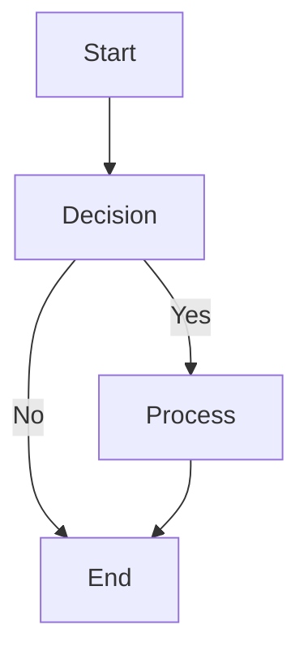
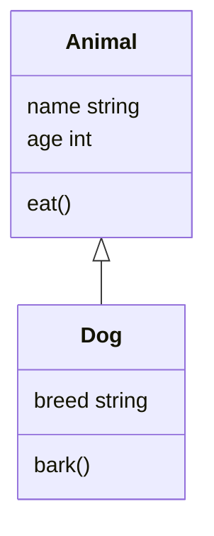
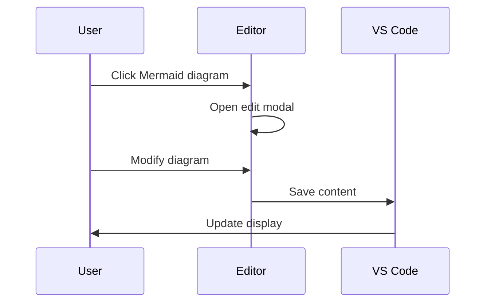

# RTF Markdown Editor — Sample Document
Welcome to the **RTF Markdown Editor**! This document demonstrates all the features of the editor.
## Text Formatting
You can use **bold**, *italic*, ***bold italic***, ~~strikethrough~~, and `inline code`.
### Headings
This is a heading level 2.
#### This is a heading level 4.
## Lists
### Bullet List
- Item 1

- Item 2

- Nested item 2a

- Nested item 2b

- Item 3

### Ordered List
- First item

- Second item

- Nested item 2.1

- Nested item 2.2

- Third item

## Block Elements
### Block Quote

> This is a block quote. You can use it to highlight important information or quotes from other sources.
> Block quotes can have multiple paragraphs.
### Code Block
```
function helloWorld() {
  console.log("Hello, World!");
}

helloWorld();

```
## Links and Images
This is a [link to VS Code](https://code.visualstudio.com).
## Tables
| Header 1 | Header 2 | Header 3 |
| --- | --- | --- |
| Row 1, Col 1 | Row 1, Col 2 | Row 1, Col 3 |
| Row 2, Col 1 | Row 2, Col 2 | Row 2, Col 3 |
| Row 3, Col 1 | Row 3, Col 2 | Row 3, Col 3 |

## Mermaid Diagrams
### Simple Flowchart



### Class Diagram



### Sequence Diagram



## RTL (Right-to-Left) Text
אלו כמה תווים בעברית לבדיקת תמיכה RTL. עורך RTF Markdown תומך בעברית וערבית באופן מלא.
العربية أيضاً مدعومة بالكامل. يمكنك الكتابة باللغة العربية والعبرية بسهولة.
## Color &amp; Highlighting
Use the toolbar to:
- Change text color

- Highlight text with background colors

- Apply multiple formatting options

## Autosave
This document is automatically saved **750 milliseconds** after you finish typing. You can also:
- Press Ctrl+S to save manually

- Close the tab to trigger autosave

- Switch to another window to trigger autosave

## Features Summary
✅ WYSIWYG editing
✅ Rich formatting toolbar
✅ RTL/LTR support
✅ Mermaid diagrams
✅ Autosave
✅ 100% offline
✅ No external dependencies
✅ Secure (strict CSP)
**Happy writing with RTF Markdown Editor!**