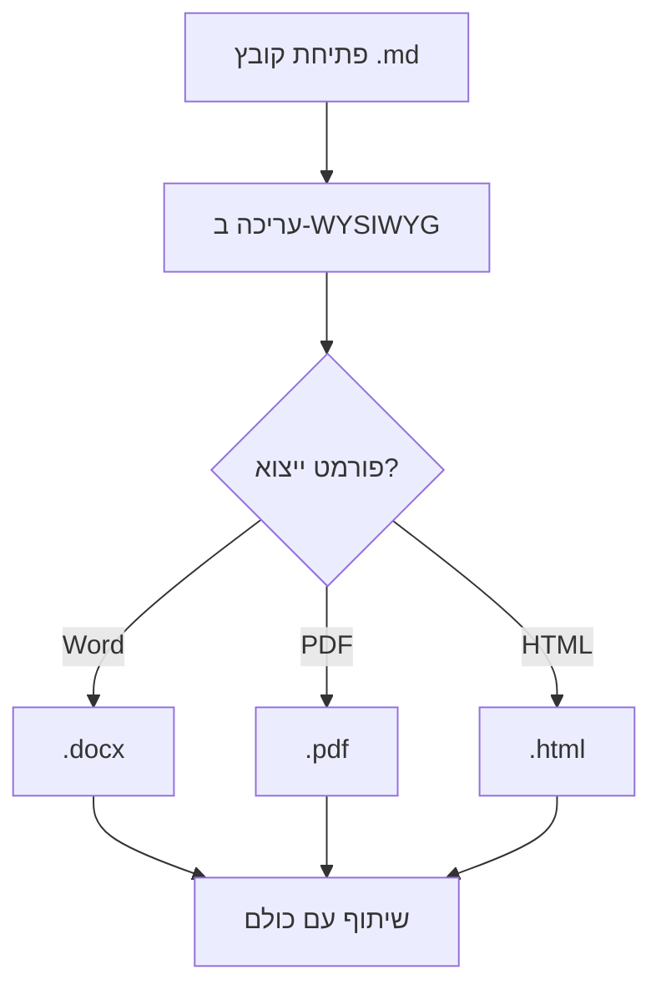
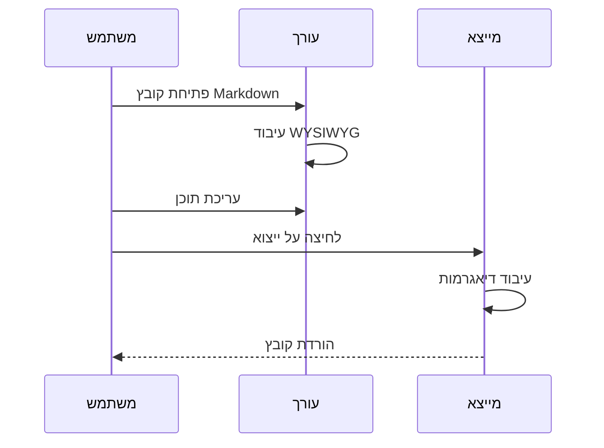
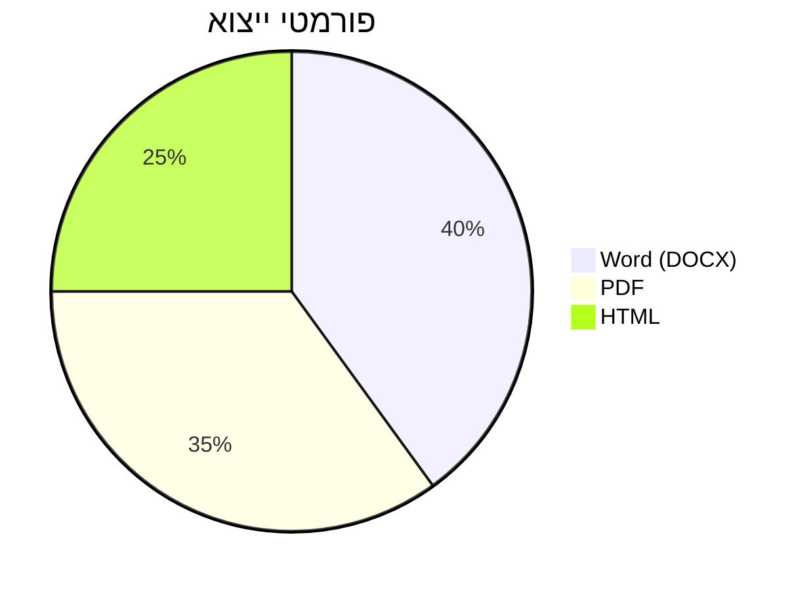
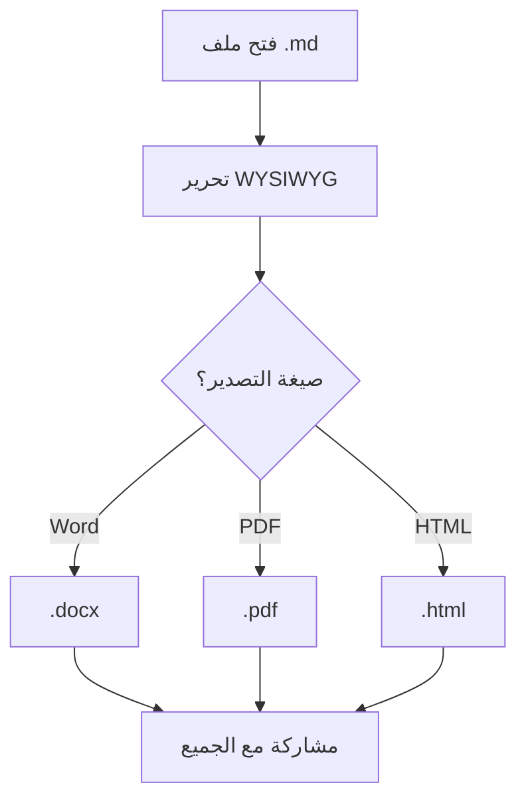

# עורך RTF Markdown — הדגמת תכונות
הדגמה מקיפה של **כל התכונות הנתמכות** במסמך אחד.
## עיצוב טקסט עשיר
העורך תומך ב-**מודגש**, *נטוי*, ~~קו חוצה~~, `קוד מוטבע`, ו-[קישורים](https://github.com). אפשר גם להשתמש ב-***מודגש ונטוי*** להדגשה.

> **שימו לב:** זהו בלוק ציטוט עם **טקסט מעוצב** בתוכו.
> הוא יכול להשתרע על מספר שורות ולכלול *כל* עיצוב.
### טקסט מודגש וצבעים
השתמשו בסרגל הכלים כדי להחיל צבעי טקסט ורקע מודגש כדי לגרום לתוכן לבלוט.
## היררכיית כותרות
### כותרת רמה שלישית
#### כותרת רמה רביעית
##### כותרת רמה חמישית
###### כותרת רמה שישית
## רשימות
### רשימה לא ממוספרת
- פריט ראשון עם **טקסט מודגש**

- פריט שני עם `קוד`

- פריט מקונן אחד

- פריט מקונן שני

- מקונן עמוק

- פריט שלישי

### רשימה ממוספרת
- התקינו את התוסף מה-Marketplace

- פתחו קובץ `.md` כלשהו

- התחילו לערוך עם סרגל הכלים WYSIWYG

- ייצאו ל-Word, PDF או HTML

### רשימת משימות
- [x] עריכה ויזואלית WYSIWYG

- [x] ייצוא ל-DOCX

- [x] ייצוא ל-PDF

- [x] ייצוא ל-HTML

- [x] ייבוא מ-Word

- [x] ייבוא מ-PDF עם OCR

- [ ] המסמך הבא שלכם

## טבלאות
| תכונה | סטטוס | הערות |
| --- | --- | --- |
| מודגש / נטוי | נתמך | סרגל כלים מלא |
| טבלאות | נתמך | שינוי גודל עמודות |
| בלוקי קוד | נתמך | הדגשת תחביר |
| דיאגרמות Mermaid | נתמך | 10+ סוגי דיאגרמות |
| תמיכה ב-RTL | נתמך | עברית, ערבית, פרסית |
| ייצוא ל-DOCX | נתמך | לחיצה אחת |
| ייצוא ל-PDF | נתמך | Chrome headless |
| ייצוא ל-HTML | נתמך | עצמאי לחלוטין |

## בלוקי קוד
```javascript
// קוד עם הערות בעברית
function greet(name) {
  const message = `שלום, ${name}!`;
  console.log(message);
  return message;
}

```
```python
# דוגמה בפייתון עם הערות בעברית
def fibonacci(n):
    """מחזיר את n המספרים הראשונים בסדרת פיבונאצ'י"""
    a, b = 0, 1
    for _ in range(n):
        yield a
        a, b = b, a + b

```
## דיאגרמות Mermaid
### תרשים זרימה



### דיאגרמת רצף



### תרשים עוגה



## תוכן מעורב דו-כיווני
פסקה זו מכילה גם עברית וגם English text שמשולבים יחד בצורה חלקה. העורך מטפל בטקסט דו-כיווני באופן אוטומטי — אפשר לכתוב in English ולחזור לעברית בלי שום בעיה.
באופן דומה, תוכן ערבי يمكن دمجه مع النص العبري والإنجليزي, והכיוון מטופל נכון בכל פורמטי הייצוא.
## מסמך טכני בעברית
### הגדרת פרויקט חדש
- התקינו את התוסף מה-Marketplace

- פתחו קובץ `.md` כלשהו

- התחילו לערוך עם סרגל הכלים

- השתמשו ב-`Ctrl+Shift+P` כדי לגשת לפקודות

```javascript
// הגדרת שרת Express עם הערות בעברית
const express = require('express');
const app = express();

// נתיב ראשי — מחזיר הודעת ברכה
app.get('/', (req, res) => {
  res.json({ message: 'שלום עולם!' });
});

// הפעלת השרת
app.listen(3000, () => {
  console.log('השרת פועל בפורט 3000');
});

```
## محتوى عربي — Arabic Content
### مرحباً بكم في محرر Markdown
هذا محرر **WYSIWYG** كامل لـ VS Code. يدعم العربية والعبرية ولغات RTL أخرى.
#### الميزات الرئيسية:
- **تحرير مرئي** — مثل Word، مباشرة في VS Code

- **تصدير** إلى Word و PDF و HTML

- **استيراد** من Word و PDF مع OCR

- **مخططات Mermaid** — مخططات انسيابية وتسلسلية وغيرها

- **100% بدون اتصال** — لا إرسال بيانات، لا تتبع

> **ملاحظة:** يتم كتابة النص من اليمين إلى اليسار، مع دعم كامل للنص ثنائي الاتجاه. يمكنك دمج English text مع النص العربي بسلاسة.
#### جدول الميزات
| الميزة | الحالة | ملاحظات |
| --- | --- | --- |
| تحرير مرئي | مدعوم | شريط أدوات كامل |
| تصدير إلى Word | مدعوم | بنقرة واحدة |
| تصدير إلى PDF | مدعوم | محرك Chrome |
| دعم RTL | مدعوم | عربي، عبري، فارسي |
| مخططات Mermaid | مدعوم | أكثر من 10 أنواع |
| استيراد من PDF | مدعوم | OCR مع دعم عربي |

#### قائمة المهام
- [x] تحرير WYSIWYG

- [x] تصدير إلى DOCX

- [x] تصدير إلى PDF

- [x] تصدير إلى HTML

- [x] استيراد من Word

- [x] استيراد من PDF مع OCR

- [ ] وثيقتك التالية

### مخطط انسيابي



### نص تقني مع كود
```python
# مثال بايثون مع تعليقات عربية
def مرحبا(الاسم):
    """تطبع رسالة ترحيب"""
    الرسالة = f"مرحباً {الاسم}!"
    print(الرسالة)
    return الرسالة

# استدعاء الدالة
مرحبا("عالم")

```
*נוצר עם *[*RTF Markdown Editor*](https://marketplace.visualstudio.com/items?itemName=NGPowerToys.rtf-markdown-editor)* ל-VS Code.*