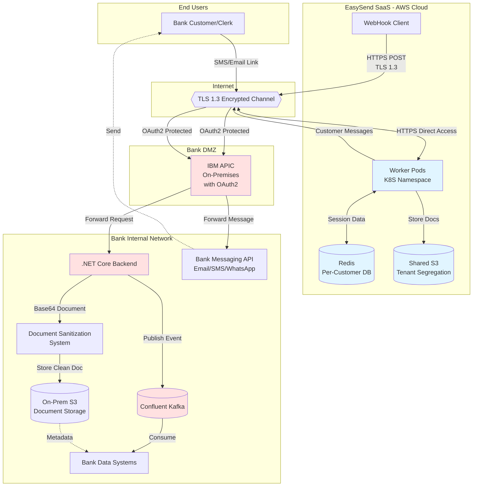
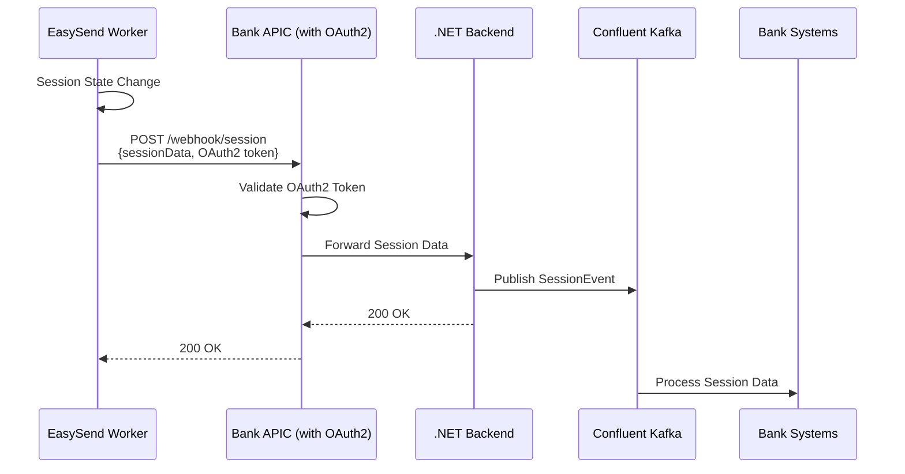
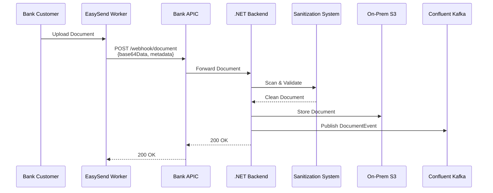
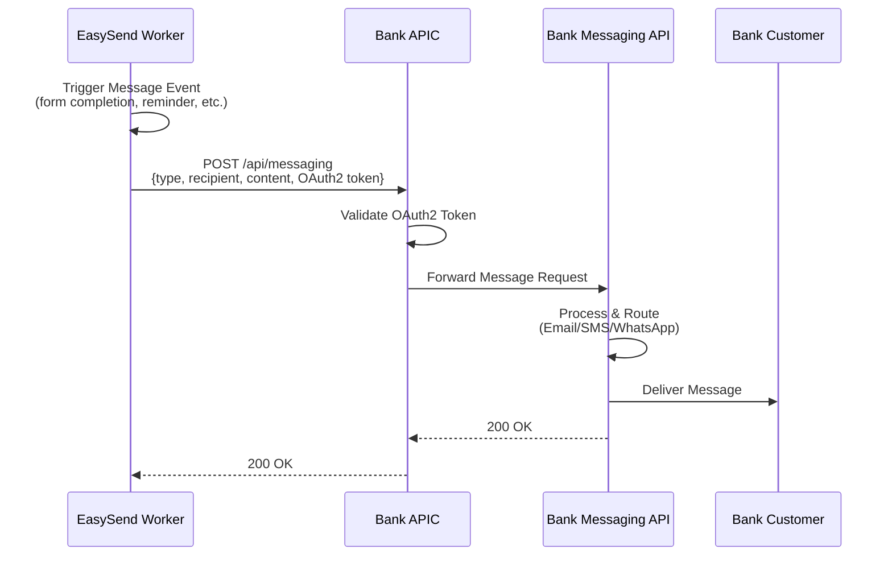

# תכנון ארכיטקטורה ברמה גבוהה: אינטגרציית EasySend לבנק
**גרסת מסמך:** 3.1
**תאריך:** 18 פברואר, 2026
**סטטוס:** טיוטה לבדיקה
**English Version:** [EasySend-Bank-Integration-HLAD.md](./EasySend-Bank-Integration-HLAD.md)
## 1. מטרת המערכת
### 1.1 סקירה כללית
EasySend היא פלטפורמת SaaS מבוססת ענן לאיסוף ועיבוד מסמכים דיגיטליים, הפרוסה על תשתית AWS. ארכיטקטורה זו מתארת את האינטגרציה של EasySend לתוך המערכת האקולוגית של הבנק כדי לאפשר אינטראקציות דיגיטליות מאובטחות ותואמות עם לקוחות, תוך שמירה על ריבונות נתונים ועמידה ברגולציה בתוך הסביבה המבוקרת של הבנק.
### 1.2 יעדים עסקיים
- לאפשר ללקוחות הבנק למלא טפסים דיגיטליים ולהעלות מסמכים דרך ממשקים ממותגים של הבנק

- לשכפל נתוני Session ומסמכים למערכות האחסון המבוקרות של הבנק

- לשמור על תאימות רגולטורית עם תקני הבנקאות הישראלית

- לשמור על אבטחת נתונים באמצעות מפתחות הצפנה מנוהלים על ידי הבנק

- למנף תשתית קיימת של הבנק (APIC, Kafka, .NET backends, S3 storage)

### 1.3 היקף
- אינטגרציה של פלטפורמת SaaS של EasySend עם מערכות הבנק דרך APIs הפונים לאינטרנט

- שכפול נתונים בזמן אמת באמצעות מנגנוני WebHook

- מודל גישה מבוסס URL: לקוחות ופקידי הבנק ניגשים למסכי EasySend דרך URLs קצרים מנוהלים על ידי הבנק המועברים ב-SMS/Email

- אינטגרציית SSO לאימות חלק של משתמשי הקצה דרך tokens ב-URL

- סניטציה של מסמכים ואחסון מאובטח בתוך תשתית הבנק

- התמדה של נתוני Session עם מדיניות שמירה הניתנת להגדרה

- הודעות ללקוחות (Email/SMS/WhatsApp) דרך API של הבנק - EasySend ישתמש במערכות ההודעות של הבנק

## 2. רכיבים וארכיטקטורת תקשורת
### 2.1 רכיבי המערכת
#### 2.1.1 פלטפורמת EasySend SaaS (AWS Cloud)
- **Location:** סביבת AWS SaaS

- **Worker Pods:** namespace ייעודי ללקוח ב-Kubernetes cluster משותף

- **Data Store:** Redis משותף עם database-per-customer isolation

- **Encryption:** Bring Your Own Key (BYOK) - הבנק מספק מפתחות הצפנה

- **Document Storage:** S3 משותף עם הפרדת tenant-per-customer

- **Session Data:** מאוחסן ב-Redis; "מסמכים" המוצגים הם אובייקטי נתונים, לא קבצים

#### 2.1.2 שכבת אינטגרציה של הבנק
- **IBM APIC (On-Premises):** API gateway הפונה לאינטרנט עבור WebHook endpoints עם אימות OAuth2 משולב

- **TLS 1.3:** ערוץ תקשורת מוצפן לכל העברת הנתונים

#### 2.1.3 מערכות Backend של הבנק
- **.NET Core Backend:** מקבל WebHook payloads, מעבד נתונים

- **Document Sanitization System:** מערכת קיימת של הבנק לסריקת וירוסים ואימות תוכן

- **Confluent Kafka:** Message broker לעיבוד נתונים אסינכרוני

- **On-Premises S3:** אחסון למסמכי לקוחות מסונטים

- **Bank Data Systems:** מערכות יעד לנתוני session ו-metadata של מסמכים

- **Bank Messaging API:** API מרכזי לתקשורת עם לקוחות (Email/SMS/WhatsApp) - EasySend יפעיל API זה לכל הודעות הלקוחות

#### 2.1.4 גישת משתמשי קצה
- **שיטת גישה:** לקוחות ופקידי הבנק מקבלים SMS/Email עם URLs קצרים מנוהלים על ידי הבנק

- **יצירת URL:** EasySend יוצר URLs של session; שירות קיצור URL של הבנק יוצר קישורים קצרים ממותגים

- **גישה ישירה:** משתמשים פותחים מסכי EasySend ישירות בדפדפן (לא מוטמעים באפליקציות הבנק)

- **SSO Integration:** אימות מבוסס OAuth2 דרך tokens ב-URL לחוויית משתמש חלקה

### 2.2 דיאגרמת ארכיטקטורה



### 2.3 רצפי זרימת נתונים
#### 2.3.1 זרימת שכפול נתוני Session



#### 2.3.2 זרימת העלאה ואחסון מסמכים



#### 2.3.3 זרימת הודעות ללקוחות



### 2.4 מודל קישוריות רשת
- **EasySend → Bank:** HTTPS יוצא בלבד (worker pods יוזמים את כל החיבורים)

- **Bank → EasySend:** אין צורך בחיבורים נכנסים מהבנק ל-EasySend

- **Internet Access:** worker pods של EasySend דורשים גישה יוצאת לאינטרנט כדי להגיע ל-APIC endpoints של הבנק

## 3. החלטות ארכיטקטוניות
### 3.1 החלטות מאושרות
| תחום החלטה | גישה נבחרת | נימוק |
| --- | --- | --- |
| שיטת שכפול נתונים | WebHook דרך אינטרנט דרך APIC של הבנק | ממנף תשתית API קיימת של הבנק; מאפשר סנכרון נתונים בזמן אמת; שומר על גבולות אבטחת הרשת |
| אבטחת תעבורה | TLS 1.3 | תקן אבטחה עדכני ביותר; נדרש להעברת נתונים הפונה לאינטרנט |
| אימות WebHook | OAuth2 | תקן תעשייתי; משתלב עם תשתית OAuth קיימת של הבנק; תומך באימות מבוסס token |
| Message Queuing | Confluent Kafka | טכנולוגיה מאושרת מראש של הבנק; מספקת עיבוד אסינכרוני אמין; מפריד בין ingestion של WebHook ללוגיקה עסקית |
| אחסון מסמכים | Bank WebHook → .NET Backend → On-Prem S3 | שומר על ריבונות נתונים; ממנף מערכת סניטציה קיימת; עומד בדרישות רגולטוריות |
| טכנולוגיית Backend | C# .NET Core | טכנולוגיה מאושרת מראש של הבנק; משתלבת עם מערכות סניטציה ואחסון קיימות |
| מודל הצפנה | Bring Your Own Key (BYOK) | הבנק שולט במפתחות הצפנה; עומד בדרישות אבטחה; מודל מוכח במגזר הבנקאות בישראל |
| אימות משתמשי קצה | OAuth2 SSO Integration | חוויית משתמש חלקה; single sign-on מפורטלי הבנק; ממנף ניהול זהויות של הבנק |

### 3.2 תאימות טכנולוגית
כל הטכנולוגיות הנבחרות הן טכנולוגיות פנימיות של הבנק **מאושרות מראש**:
- ✅ IBM APIC (Connectivity)

- ✅ OAuth2 (Authentication)

- ✅ REST API / WebHooks (Integration Pattern)

- ✅ Confluent Kafka (Messaging)

- ✅ C# .NET Core (Backend Development)

- ✅ On-Premises S3 (Storage)

**רכיב Third-Party:** EasySend SaaS Platform
- סטטוס: כבר בשימוש על ידי מספר בנקים ישראליים

- תאימות: EasySend מתחייבת לכל דרישות התאימות הרגולטורית

- אבטחה: תומכת במודל הצפנת BYOK

### 3.3 החלטות שנרשמו לאחר דיון
| תאריך | החלטה | תוצאה |
| --- | --- | --- |
| 2025-11-30 | בחירת פרוטוקול SSO | OAuth2 נבחר לאינטגרציית SSO |
| 2025-11-30 | מודל קישוריות רשת | EasySend יוצא בלבד; אין צורך ב-bank-to-EasySend נכנס |
| 2025-11-30 | סניטציית מסמכים | אינטגרציה עם מערכת סניטציה קיימת של הבנק |
| 2025-11-30 | מדיניות שמירה | מדיניות רגולטורית מיושמת בתוך הבנק; שמירת session data נפרדת |
| עתידי |  | מקום להחלטות נוספות |

## 4. נקודות לדיון
### 4.1 אסטרטגיית אחסון מסמכים
**נושא:** מעבר מ-S3 מנוהל על ידי EasySend לאחסון S3 של הבנק דרך WebHook
**מצב נוכחי:**
- מסמכים שהועלו על ידי משתמשים מאוחסנים כרגע ב-S3 משותף של EasySend (מופרד tenant)

**גישה מוצעת:**
- APIC WebHook מקבל נתוני מסמך מקודדים base64

- .NET backend מעבד מסמך דרך מערכת סניטציה

- מסמך מסונט מאוחסן ב-S3 on-premises

**שאלות לדיון:**
- האם יש לשכפל את כל המסמכים לאחסון הבנק, או רק סוגי מסמכים ספציפיים?

- תזמון: שכפול בזמן אמת לעומת עיבוד batch?

- מנגנון גיבוי אם אחסון הבנק אינו זמין?

- האם EasySend צריך לשמור עותק ב-S3 שלהם ל-disaster recovery?

**מרחב החלטה:**
```
תאריך החלטה: _______________
בעלי עניין: _______________
תוצאה: 

```
### 4.2 מדיניות שמירת נתונים
**נושא:** דרישות שמירה של נתוני session ומסמכים
**שיקולים מרכזיים:**
- **שמירה רגולטורית:** הבנק יישם מדיניות שמירה רגולטורית סטנדרטית (בדרך כלל 7 שנים למסמכים בנקאיים)

- **Session Data:** צריך להיות בעל שמירה שונה ממסמכים שהועלו

- **שמירת EasySend:** נדרש תיאום עם מדיניות שמירה של פלטפורמת SaaS של EasySend

**שאלות לדיון:**
- מהי תקופת השמירה לנתוני session (למשל, 90 יום, שנה)?

- לאחר שכפול לבנק, האם EasySend יכול למחוק נתונים ממערכותיהם מיד?

- מי אחראי לאכיפת מחיקת נתונים (בנק, EasySend, או שניהם)?

- אסטרטגיית גיבוי וארכיון לשמירה ארוכת טווח?

**מרחב החלטה:**
```
תאריך החלטה: _______________
בעלי עניין: _______________
שמירת <span dir="ltr">Session Data</span>: _____ ימים/חודשים/שנים
שמירת מסמכים: _____ שנים (רגולטורי)
ניקוי <span dir="ltr">EasySend</span>: לאחר _____ ימים של שכפול מוצלח
אסטרטגיית ארכיון: 

```
### 4.3 פרטי אינטגרציית SSO
**נושא:** יישום זרימת אימות משתמשי קצה
**גישה מאושרת:** OAuth2
**שאלות לדיון:**
- ספק זהות: איזו מערכת בנק מנפיקה OAuth2 tokens?

- היקף token ו-claims הנדרשים על ידי EasySend?

- זמן חיים של token ומנגנון רענון?

- מיפוי מאפייני משתמש (שם, מזהה לקוח, מספרי חשבון וכו')?

- תיאום timeout של session בין פורטל הבנק ל-EasySend?

**מרחב החלטה:**
```
תאריך החלטה: _______________
בעלי עניין: _______________
מערכת <span dir="ltr">IdP</span>: _______________
זמן חיים של <span dir="ltr">Token</span>: _______________
<span dir="ltr">Claims</span> נדרשים: 

```
### 4.4 דרישות קישוריות רשת
**נושא:** אימות מודל קישוריות
**מודל מאושר:** worker pods של EasySend דורשים גישה יוצאת לאינטרנט בלבד
**שאלות לדיון:**
- האם ישנן דרישות ניטור או בדיקת health שידרשו קישוריות bank-to-EasySend?

- חוקי Firewall: אילו טווחי IP מקור צריכים להיות מורשים להגיע ל-APIC endpoints של הבנק?

- מדיניות הגבלת קצב ו-throttling לקריאות WebHook?

- תבנית circuit breaker אם endpoints של הבנק אינם זמינים?

**מרחב החלטה:**
```
תאריך החלטה: _______________
בעלי עניין: _______________
<span dir="ltr">IPs</span>/טווחים מורשים: _______________
מגבלות קצב: _____ בקשות/שנייה
אסטרטגיית בדיקת <span dir="ltr">Health</span>: 

```
## 5. נקודות לבירור
### 5.1 בירורים טכניים נדרשים
| # | פריט | פרטים נדרשים | עדיפות | סטטוס |
| --- | --- | --- | --- | --- |
| 1 | APIC Endpoint URLs | כתובות URL מדויקות של WebHook endpoint עבור APIs של session ומסמכים | גבוהה | ממתין |
| 2 | OAuth2 Token Endpoint | endpoint להנפקת token, אישורי client, פורמט token | גבוהה | ממתין |
| 3 | Kafka Topics | שמות topic עבור אירועי session ואירועי מסמכים | בינונית | ממתין |
| 4 | Document Schema | JSON schema עבור metadata של מסמכים ונתוני session | גבוהה | ממתין |
| 5 | Error Handling | מדיניות retry, קודי שגיאה, ערכי timeout עבור WebHooks | גבוהה | ממתין |
| 6 | Sanitization SLA | זמן עיבוד ומגבלות גודל לסניטציית מסמכים | בינונית | ממתין |
| 7 | S3 Bucket Names | שמות bucket יעד ומבנה תיקיות למסמכים | בינונית | ממתין |
| 8 | Monitoring &amp; Logging | נקודות אינטגרציה למערכות ניטור של הבנק | בינונית | ממתין |

### 5.2 בירורים שנרשמו
| תאריך | פריט | בירור | סופק על ידי |
| --- | --- | --- | --- |
| 2025-11-30 | פרוטוקול SSO | OAuth2 אושר | צוות ארכיטקטורה |
| 2025-11-30 | מודל רשת | יוצא בלבד מ-EasySend | צוות ארכיטקטורה |
| 2025-11-30 | מערכת סניטציה | מערכת בנק קיימת, נדרשת אינטגרציה | צוות ארכיטקטורה |
| 2025-11-30 | תצורת APIC | On-premises, כבר מוגדר | צוות ארכיטקטורה |
| עתידי |  |  |  |

### 5.3 תלויות והנחות
**תלויות:**
- מערכת סניטציה קיימת של הבנק חייבת לתמוך באינטגרציית API פרוגרמטית

- תשתית APIC כבר מוגדרת ל-endpoints הפונים לאינטרנט עם OAuth2

- מערכת OAuth2 SSO של הבנק יכולה להנפיק tokens לאינטגרציית EasySend

- ל-Confluent Kafka cluster יש קיבולת לזרמי אירועים נוספים

- לתשתית S3 on-premises יש קיבולת מספקת למסמכי לקוחות

**הנחות:**
- אמינות WebHook של EasySend: SLA של 99.9% זמינות

- עיכוב רשת: &lt;500ms ל-round-trip של WebHook דרך אינטרנט

- מגבלות גודל מסמך: עד 50MB למסמך (יש לאשר)

- משתמשים בו-זמניים: עד 1,000 sessions בו-זמניות (יש לאמת)

- הצפנת BYOK אינה משפיעה על ביצועי EasySend באופן משמעותי

**סיכונים ומיטיגציות:**
- **סיכון:** כשלי קישוריות אינטרנט משבשים שכפול נתונים

- *מיטיגציה:* EasySend מיישמת לוגיקת retry עם backoff אקספוננציאלי; Kafka מספק אחסון הודעות עמיד

- **סיכון:** סניטציית מסמכים הופכת ל-bottleneck

- *מיטיגציה:* Scale מערכת סניטציה; יישום עיבוד אסינכרוני דרך Kafka

- **סיכון:** חששות ריבונות נתונים עם אחסון AWS של EasySend

- *מיטיגציה:* הצפנת BYOK + שכפול חובה לאחסון הבנק + מדיניות שמירה מוגדרות

## 6. צעדים הבאים
### 6.1 פעולות מיידיות
- **פגישת סקירת תכנון טכני** - סקור HLAD זה עם בעלי עניין

- **פתור נקודות לדיון** - קבל החלטות על אסטרטגיית אחסון מסמכים ומדיניות שמירה

- **השג בירורים** - אסוף פרטים טכניים המפורטים בסעיף 5.1

- **תכנון ברמה נמוכה** - צור מפרטים טכניים מפורטים כולל:

- חוזי API (OpenAPI specs)

- סכמות נתונים (JSON schemas)

- טיפול בשגיאות ומנגנוני retry

- אסטרטגיית ניטור ואזעקה

- הליכי disaster recovery

### 6.2 אישור וממשל
- **Architecture Review Board:** נדרש אישור לפני יישום

- **סקירת אבטחה:** אימות יישום OAuth2 ותצורת TLS

- **סקירת תאימות:** אישור גישת תאימות רגולטורית

- **הערכת Third-Party:** אימות אבטחה ותאימות של EasySend

**בקרת מסמך:**
- **מחבר:** צוות ארכיטקטורת ארגונית

- **בודקים:** *יש להקצות*

- **מאשרים:** *יש להקצות*

- **תאריך סקירה הבא:** *יש לתזמן*