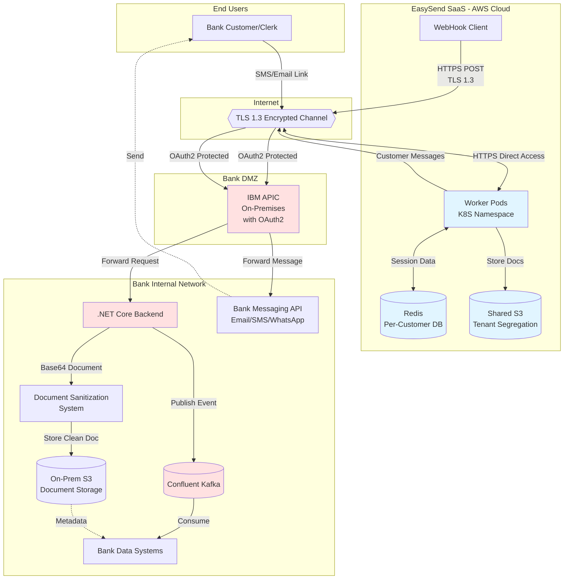
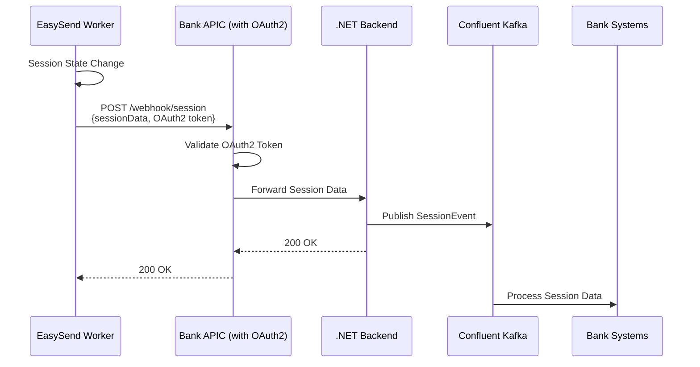
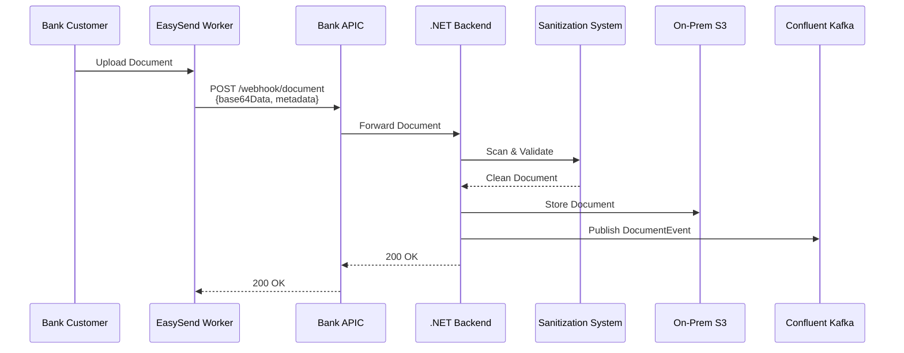
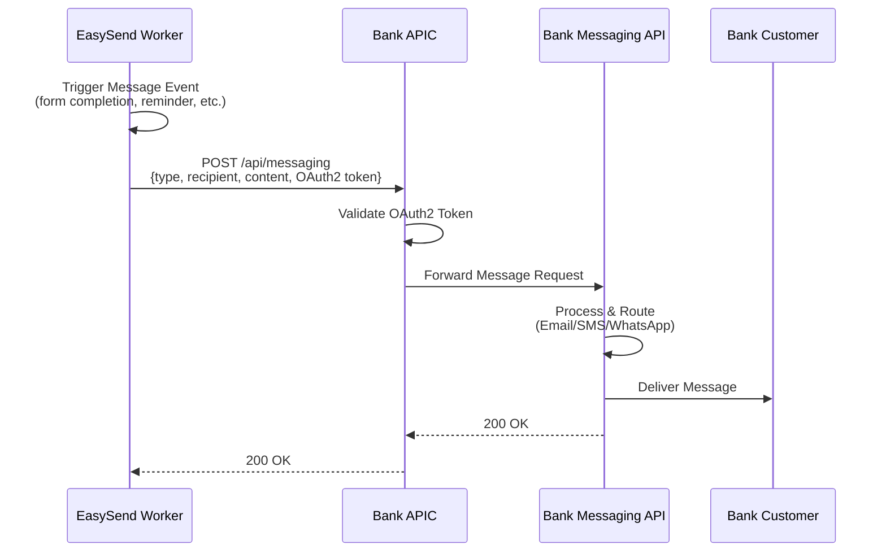

# High-Level Architecture Design: EasySend Bank Integration
**Document Version:** 1.0
**Date:** November 30, 2025
**Status:** Draft for Review
**Hebrew Version:** [EasySend-Bank-Integration-HLAD-HE.md](./EasySend-Bank-Integration-HLAD-HE.md)


## 1. System Purpose
### 1.1 Overview
EasySend is a cloud-based SaaS platform for digital document collection and processing, deployed on AWS infrastructure. This architecture describes the integration of EasySend into the bank's ecosystem to enable secure, compliant digital customer interactions while maintaining data sovereignty and regulatory compliance within the bank's controlled environment.
### 1.2 Business Objectives
- Enable bank customers to complete digital forms and upload documents through bank-branded interfaces

- Replicate session and document data into bank-controlled storage systems

- Maintain regulatory compliance with Israeli banking standards

- Preserve data security using bank-managed encryption keys

- Leverage existing bank infrastructure (APIC, Kafka, .NET backends, S3 storage)

### 1.3 Scope
- Integration of EasySend SaaS platform with bank systems via internet-facing APIs

- Real-time data replication using WebHook mechanisms

- URL-based access model: Bank customers and clerks access EasySend screens via bank-managed short URLs delivered through SMS/Email

- SSO integration for seamless end-user authentication via URL tokens

- Document sanitization and secure storage within bank infrastructure

- Session data persistence with configurable retention policies

- Customer messaging (Email/SMS/WhatsApp) via Bank API - EasySend will use bank's messaging systems

## 2. Components &amp; Communication Architecture
### 2.1 System Components
#### 2.1.1 EasySend SaaS Platform (AWS Cloud)
- **Location:** AWS SaaS environment

- **Worker Pods:** Customer-specific namespace in shared Kubernetes cluster

- **Data Store:** Persistent shared Redis with database-per-customer isolation

- **Encryption:** Bring Your Own Key (BYOK) - bank provides encryption keys

- **Document Storage:** Shared S3 with tenant-per-customer segregation

- **Session Data:** Stored in Redis; "documents" displayed are data objects, not files

#### 2.1.2 Bank Integration Layer
- **IBM APIC (On-Premises):** Internet-facing API gateway for WebHook endpoints with integrated OAuth2 authentication

- **TLS 1.3:** Encrypted communication channel for all data transmission

#### 2.1.3 Bank Backend Systems
- **.NET Core Backend:** Receives WebHook payloads, processes data

- **Document Sanitization System:** Existing bank system for virus scanning and content validation

- **Confluent Kafka:** Message broker for asynchronous data processing

- **On-Premises S3:** Storage for sanitized customer documents

- **Bank Data Systems:** Target systems for session data and document metadata

- **Bank Messaging API:** Centralized API for customer communications (Email/SMS/WhatsApp) - EasySend will invoke this API for all customer messaging

#### 2.1.4 End-User Access
- **Access Method:** Bank customers and clerks receive SMS/Email with bank-managed short URLs

- **URL Generation:** EasySend creates session URLs; bank URL shortening service generates branded short links

- **Direct Access:** Users open EasySend screens directly in browser (not embedded in bank apps)

- **SSO Integration:** OAuth2-based authentication via URL tokens for seamless user experience

### 2.2 Architecture Diagram



### 2.3 Data Flow Sequences
#### 2.3.1 Session Data Replication Flow



#### 2.3.2 Document Upload &amp; Storage Flow



#### 2.3.3 Customer Messaging Flow



### 2.4 Network Connectivity Model
- **EasySend → Bank:** Outbound HTTPS only (worker pods initiate all connections)

- **Bank → EasySend:** No inbound connections required from bank to EasySend

- **Internet Access:** EasySend worker pods require outbound internet access to reach bank APIC endpoints

## 3. Architecture Decisions
### 3.1 Approved Decisions
| Decision Area | Selected Approach | Rationale |
| --- | --- | --- |
| Data Replication Method | WebHook over Internet via Bank APIC | Leverages existing bank API infrastructure; enables real-time data sync; maintains network security boundaries |
| Transport Security | TLS 1.3 | Latest security standard; required for internet-facing data transmission |
| WebHook Authentication | OAuth2 | Industry standard; integrates with bank's existing OAuth infrastructure; supports token-based authentication |
| Message Queuing | Confluent Kafka | Pre-approved bank technology; provides reliable asynchronous processing; decouples WebHook ingestion from business logic |
| Document Storage | Bank WebHook → .NET Backend → On-Prem S3 | Maintains data sovereignty; leverages existing sanitization system; complies with regulatory requirements |
| Backend Technology | C# .NET Core | Pre-approved bank technology; integrates with existing sanitization and storage systems |
| Encryption Model | Bring Your Own Key (BYOK) | Bank controls encryption keys; meets security requirements; proven model in IL banking sector |
| End-User Authentication | OAuth2 SSO Integration | Seamless user experience; single sign-on from bank portals; leverages bank identity management |

### 3.2 Technology Compliance
All selected technologies are **pre-approved** bank internal technologies:
- ✅ IBM APIC (Connectivity)

- ✅ OAuth2 (Authentication)

- ✅ REST API / WebHooks (Integration Pattern)

- ✅ Confluent Kafka (Messaging)

- ✅ C# .NET Core (Backend Development)

- ✅ On-Premises S3 (Storage)

**Third-Party Component:** EasySend SaaS Platform
- Status: Already in use by several Israeli banks

- Compliance: EasySend commits to all regulatory compliance requirements

- Security: Supports BYOK encryption model

### 3.3 Decisions Recorded After Discussion
| Date | Decision | Outcome |
| --- | --- | --- |
| 2025-11-30 | SSO Protocol Selection | OAuth2 selected for SSO integration |
| 2025-11-30 | Network Connectivity Model | EasySend outbound-only; no bank-to-EasySend inbound required |
| 2025-11-30 | Document Sanitization | Integration with existing bank sanitization system |
| 2025-11-30 | Retention Policies | Regulatory policies applied within bank; session data separate retention |
| Future |  | Space for additional decisions |

## 4. Discussion Points
### 4.1 Document Storage Strategy
**Topic:** Transition from EasySend-managed S3 to bank S3 storage via WebHook
**Current State:**
- Documents uploaded by users currently stored in EasySend shared S3 (tenant-segregated)

**Proposed Approach:**
- APIC WebHook receives base64-encoded document data

- .NET backend processes document through sanitization system

- Sanitized document stored in on-premises S3

**Questions for Discussion:**
- Should ALL documents be replicated to bank storage, or only specific document types?

- Timing: Real-time replication vs. batch processing?

- Fallback mechanism if bank storage is unavailable?

- Should EasySend maintain copy in their S3 for disaster recovery?

**Decision Space:**
```
Decision Date: _______________
Stakeholders: _______________
Outcome: 

```
### 4.2 Data Retention Policies
**Topic:** Session data and document retention requirements
**Key Considerations:**
- **Regulatory Retention:** Bank will apply standard regulatory retention policies (typically 7 years for banking documents)

- **Session Data:** Should have different retention than uploaded documents

- **EasySend Retention:** Coordination needed with EasySend SaaS platform retention

**Questions for Discussion:**
- What is the retention period for session data (e.g., 90 days, 1 year)?

- After replication to bank, can EasySend delete data from their systems immediately?

- Who is responsible for data deletion enforcement (bank, EasySend, or both)?

- Backup and archival strategy for long-term retention?

**Decision Space:**
```
Decision Date: _______________
Stakeholders: _______________
Session Data Retention: _____ days/months/years
Document Retention: _____ years (regulatory)
EasySend Cleanup: After _____ days of successful replication
Archive Strategy: 

```
### 4.3 SSO Integration Details
**Topic:** End-user authentication flow implementation
**Confirmed Approach:** OAuth2
**Questions for Discussion:**
- Identity provider: Which bank system issues OAuth2 tokens?

- Token scope and claims required by EasySend?

- Token lifetime and refresh mechanism?

- User attribute mapping (name, customer ID, account numbers, etc.)?

- Session timeout coordination between bank portal and EasySend?

**Decision Space:**
```
Decision Date: _______________
Stakeholders: _______________
IdP System: _______________
Token Lifetime: _______________
Required Claims: 

```
### 4.4 Network Connectivity Requirements
**Topic:** Connectivity model validation
**Confirmed Model:** EasySend worker pods require outbound internet access only
**Questions for Discussion:**
- Are there any monitoring or health check requirements that would need bank-to-EasySend connectivity?

- Firewall rules: What source IP ranges should be allowed to reach bank APIC endpoints?

- Rate limiting and throttling policies for WebHook calls?

- Circuit breaker pattern if bank endpoints are unavailable?

**Decision Space:**
```
Decision Date: _______________
Stakeholders: _______________
Allowed Source IPs/Ranges: _______________
Rate Limits: _____ requests/second
Health Check Strategy: 

```
## 5. Points for Clarification
### 5.1 Technical Clarifications Required
| # | Item | Details Needed | Priority | Status |
| --- | --- | --- | --- | --- |
| 1 | APIC Endpoint URLs | Exact WebHook endpoint URLs for session and document APIs | High | Pending |
| 2 | OAuth2 Token Endpoint | Token issuance endpoint, client credentials, token format | High | Pending |
| 3 | Kafka Topics | Topic names for session events and document events | Medium | Pending |
| 4 | Document Schema | JSON schema for document metadata and session data | High | Pending |
| 5 | Error Handling | Retry policy, error codes, timeout values for WebHooks | High | Pending |
| 6 | Sanitization SLA | Processing time and size limits for document sanitization | Medium | Pending |
| 7 | S3 Bucket Names | Target bucket names and folder structure for documents | Medium | Pending |
| 8 | Monitoring &amp; Logging | Integration points for bank monitoring systems | Medium | Pending |

### 5.2 Clarifications Recorded
| Date | Item | Clarification | Provided By |
| --- | --- | --- | --- |
| 2025-11-30 | SSO Protocol | OAuth2 confirmed | Architecture Team |
| 2025-11-30 | Network Model | Outbound-only from EasySend | Architecture Team |
| 2025-11-30 | Sanitization System | Existing bank system, integration required | Architecture Team |
| 2025-11-30 | APIC Configuration | On-premises, already configured | Architecture Team |
| Future |  |  |  |

### 5.3 Dependencies &amp; Assumptions
**Dependencies:**
- Existing bank sanitization system must support programmatic API integration

- APIC infrastructure already configured for internet-facing endpoints with OAuth2

- Bank OAuth2 SSO system can issue tokens for EasySend integration

- Confluent Kafka cluster has capacity for additional event streams

- On-premises S3 infrastructure has sufficient capacity for customer documents

**Assumptions:**
- EasySend WebHook reliability: 99.9% uptime SLA

- Network latency: &lt;500ms for WebHook round-trip over internet

- Document size limits: Up to 50MB per document (to be confirmed)

- Concurrent users: Up to 1,000 simultaneous sessions (to be validated)

- BYOK encryption does not impact EasySend performance significantly

**Risks &amp; Mitigations:**
- **Risk:** Internet connectivity failures break data replication

- *Mitigation:* EasySend implements retry logic with exponential backoff; Kafka provides durable message storage

- **Risk:** Document sanitization becomes bottleneck

- *Mitigation:* Scale sanitization system; implement asynchronous processing via Kafka

- **Risk:** Data sovereignty concerns with EasySend AWS storage

- *Mitigation:* BYOK encryption + mandatory replication to bank storage + defined retention policies

## 6. Next Steps
### 6.1 Immediate Actions
- **Technical Design Review Meeting** - Review this HLAD with stakeholders

- **Resolve Discussion Points** - Make decisions on document storage strategy and retention policies

- **Obtain Clarifications** - Gather technical details listed in Section 5.1

- **Low-Level Design** - Create detailed technical specifications including:

- API contracts (OpenAPI specs)

- Data schemas (JSON schemas)

- Error handling and retry mechanisms

- Monitoring and alerting strategy

- Disaster recovery procedures

### 6.2 Approval &amp; Governance
- **Architecture Review Board:** Approval required before implementation

- **Security Review:** Validation of OAuth2 implementation and TLS configuration

- **Compliance Review:** Confirmation of regulatory compliance approach

- **Third-Party Assessment:** EasySend security and compliance validation

**Document Control:**
- **Author:** Enterprise Architecture Team

- **Reviewers:** *To be assigned*

- **Approvers:** *To be assigned*

- **Next Review Date:** *To be scheduled*