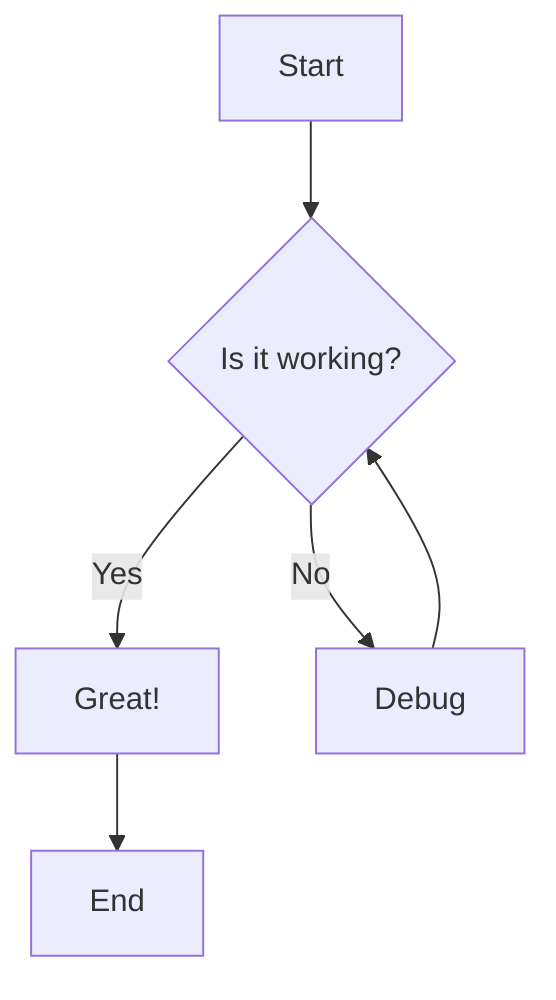
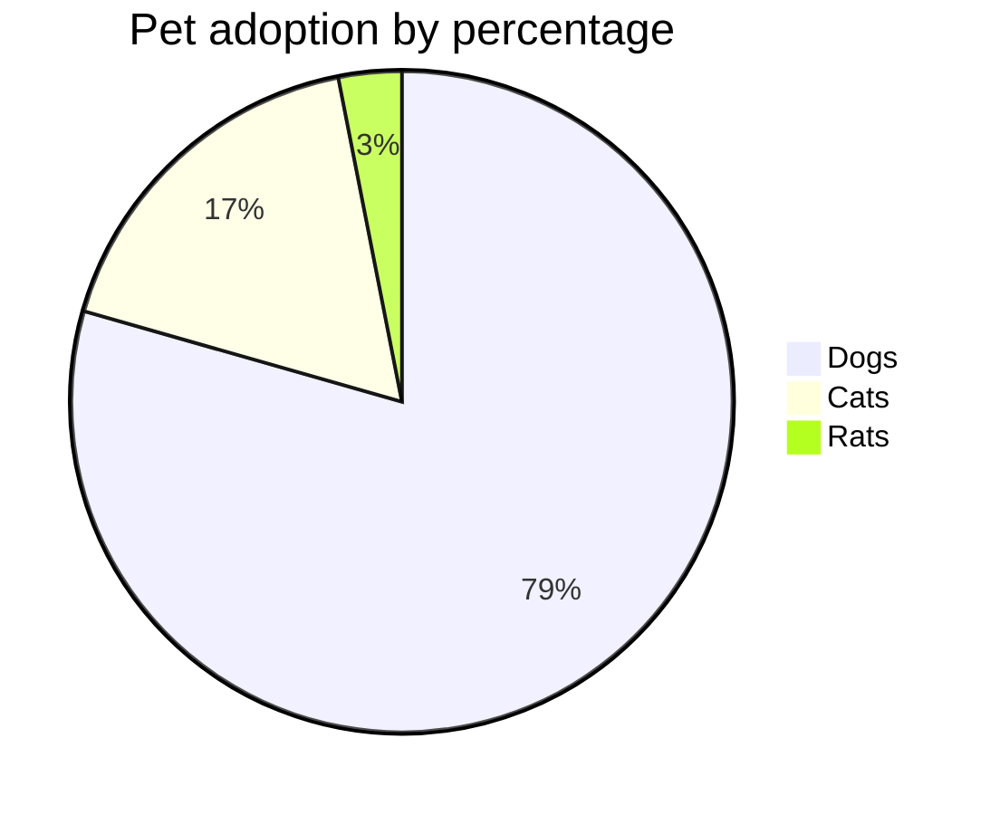

# Test Export with Diagrams

This is a test document with a Mermaid diagram.

## Simple Flowchart

## Another Diagram

Regular text continues here. The diagrams above should be rendered when you export this.
