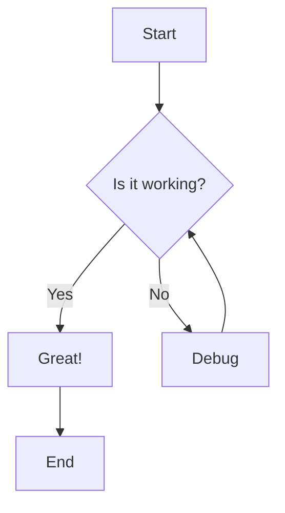
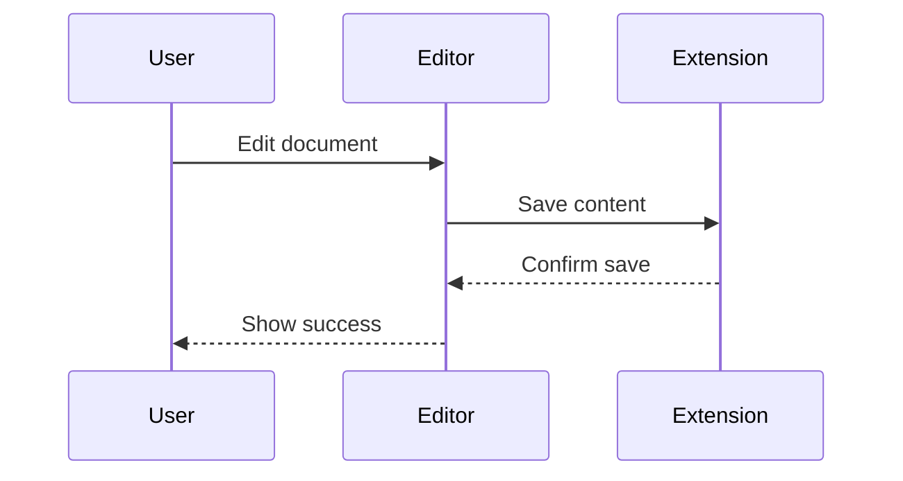
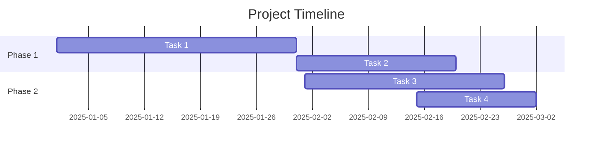

# RTF Markdown Editor - Complete Feature Test
This document *demonstrates *all *features *_supported _`by `the RTF **Markdown **Editor.
## Text Formatting
**Bold text** demonstrates strong emphasis.
*Italic text* shows emphasized text.
_Underlined text_ for important highlights.
~~Strikethrough text~~ for deleted content.
`Inline code` for technical terms like `const variable = true;`.
Red colored text and blue colored text.
Yellow highlighted text and green highlighted text.
## Headings
# Heading 1
## Heading 2
### Heading 3
#### Heading 4
##### Heading 5
###### Heading 6
## Lists
### Bullet List
- First item

- Second item
- Nested item 1

- Nested item 2

- Third item

### Ordered List
- First step

- Second step
- Sub-step A

- Sub-step B

- Third step

## Blockquotes

> This is a blockquote.
> It can span multiple lines.
> And have multiple paragraphs.
## Code Blocks
```
function greet(name) {
  console.log(`Hello, ${name}!`);
  return true;
}

greet("World");

```
```
def calculate_sum(a, b):
    """Calculate the sum of two numbers."""
    return a + b

result = calculate_sum(5, 3)
print(f"Result: {result}")

```
## Links
[Visit GitHub](https://github.com) for code repositories.
[RTF Markdown Editor Repository](https://github.com/NextGenPowerToys/rtf-markdown-editor)
## Images


## Tables
| Feature | Support | Description |
| --- | --- | --- |
| Bold | ✅ | Strong emphasis |
| Italic | ✅ | Emphasized text |
| Tables | ✅ | Structured data |
| Math | ✅ | LaTeX formulas |
| Mermaid | ✅ | Diagrams |

| Left Aligned | Center Aligned | Right Aligned |
| --- | --- | --- |
| Cell 1 | Cell 2 | Cell 3 |
| Data A | Data B | Data C |

## Horizontal Rule
Content above the line.
Content below the line.
## Math Formulas
### Inline Math
The quadratic formula is  and Einstein's famous equation is .
### Block Math

# 
\begin{bmatrix}
a &amp; b \
c &amp; d
\end{bmatrix}
\begin{bmatrix}
x \
y
\end{bmatrix}
\begin{bmatrix}
ax + by \
cx + dy
\end{bmatrix}

## Mermaid Diagrams
### Flowchart



### Sequence Diagram



### Gantt Chart



## RTL Text Support
This is Left-to-Right (LTR) text in English.
זהו טקסט מימין לשמאל בעברית. העורך תומך בשפות RTL באופן מלא.
هذا نص من اليمين إلى اليسار بالعربية. يدعم المحرر لغات RTL بشكل كامل.
## Combined Formatting
You can combine ***bold and italic***, or **bold with _underline_**, or even ***bold, italic, and _underline_*** together.
Here's a complex example: highlighted text with **bold** and *italic* and `code` all in one sentence.
## Nested Lists with Formatting
- **First major point** with bold text
- *Nested bullet* with italic

- Another nested item with `inline code`

- **Second major point**
- Sub-point with [a link](https://example.com)

- Sub-point with ~~strikethrough~~

- **Third major point** with highlighting

## Mixed Content Example
Here's a paragraph that combines multiple features: **Bold statement** followed by *emphasized text*, then some `code`, a [link to documentation](https://docs.example.com), and finally highlighted important note.
The formula  represents the Pythagorean theorem, which is fundamental in geometry.
## Summary Table
| Category | Features |
| --- | --- |
| Text | Bold, Italic, Underline, Strikethrough, Code |
| Structure | Headings (H1-H6), Lists, Tables, Blockquotes |
| Media | Images, Links |
| Advanced | Math (LaTeX), Mermaid Diagrams, RTL Support |
| Styling | Text Color, Highlighting, Alignment |

**Document End** - All features demonstrated above! ✨