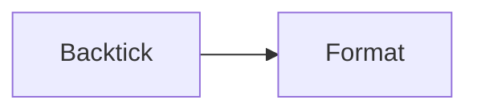

# Quick Mermaid Fence Test

## Test 1: Standard Backtick Format



## Test 2: Azure DevOps Colon Format

:::: mermaid
graph LR
    C[Colon] --> D[Format]
::::

## Instructions

1. Open this file in the RTF Markdown Editor
2. Verify both diagrams render correctly
3. Make a small edit (add a space somewhere)
4. Save the file (Ctrl+S or wait for autosave)
5. Close and reopen in text editor
6. Verify:
   - Test 1 still has ` ```mermaid ` fences
   - Test 2 still has `:::: mermaid` fences

**Expected Result:** Each diagram preserves its original fence format.
