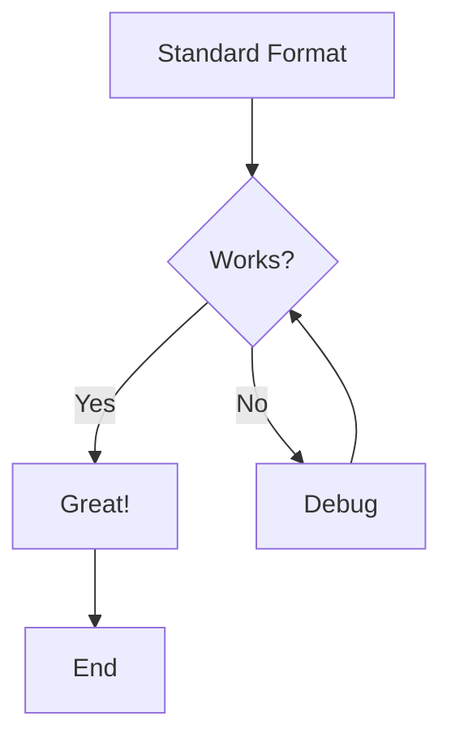
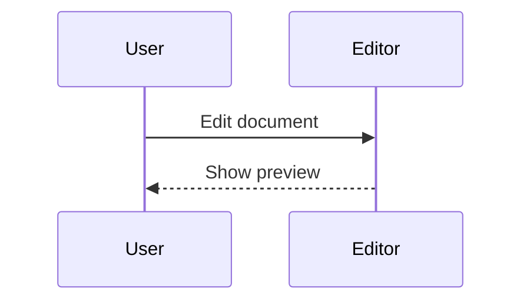

# Mermaid Diagram Format Test

This document tests both standard and Azure DevOps mermaid syntax.

## Standard Markdown Format (Backticks)

## Azure DevOps Format (Colons)

:::: mermaid
graph TD
    A[Azure DevOps Format] --> B{Works?}
    B -->|Yes| C[Great!]
    B -->|No| D[Debug]
    D --> B
    C --> E[End]
::::

## Another Standard Format

## Another Azure DevOps Format

:::: mermaid
sequenceDiagram
    participant Developer
    participant AzureDevOps
    Developer->>AzureDevOps: Push code
    AzureDevOps-->>Developer: Run CI/CD
::::

## Test Preservation

When you save this document, each mermaid block should preserve its original format:
- Backtick blocks should remain as \`\`\`mermaid
- Colon blocks should remain as :::: mermaid
